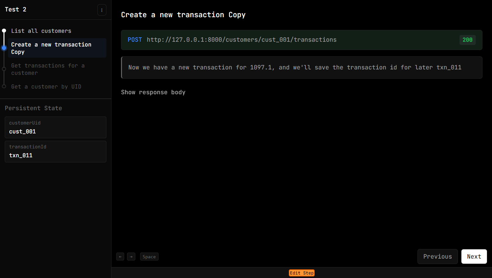

# Bondtrace Player Guide

The player is a web app for curating and playing API demos. You load a `tape.json` (from the recorder), optionally a `story.json` (your curated version), and step through the timeline.

---

## How it works

The player has three main areas:



1. **Timeline (left)** – A vertical list of API steps. Each step shows the HTTP verb (color-coded: GET=green, POST=blue, PUT/PATCH=orange, DELETE=red) and your custom title. Hidden steps are omitted. Below the timeline, **Persistent State** shows variables carried across steps (e.g. `customerUid`, `transactionId`).

2. **Step detail (centre/right)** – The current step’s request URL, status, and captions. Pre- and post-phase are separate: before “sending” you see the pre-caption; after, you see the response and post-caption. Use **Space** to toggle request/response body visibility. **←** and **→** (or Previous/Next) move between steps. At the bottom of this panel, **Edit Step** opens the curation sidebar.

3. **Curation (Edit Step)** – Click **Edit Step** (below the navigation buttons) to rename the step, hide it, add captions, define persistent fields, or set up templating (`{{response.body.id}}`, `{{state.customerId}}`, etc.). Export the story when done.

---

## Running locally

### One-time setup

From the repo root:

```bash
npm install
npm run build
```

### Start the dev server

```bash
npm run play
```

Open http://localhost:5173. The player loads with a file picker—load your `tape.json` to begin.

---

## Loading files

| File | Required | Purpose |
|------|----------|---------|
| `tape.json` | Yes | Raw recording from the recorder. Contains all requests, responses, and state. |
| `story.json` | No | Curated story (captions, hidden steps, persistent field labels). If you load both, the story overrides the tape’s metadata. |

**Workflow:** Load a tape → curate in the sidebar (rename steps, hide setup, add captions) → export `story.json` for reuse. Next time you can load the tape + story to skip re-curating.
